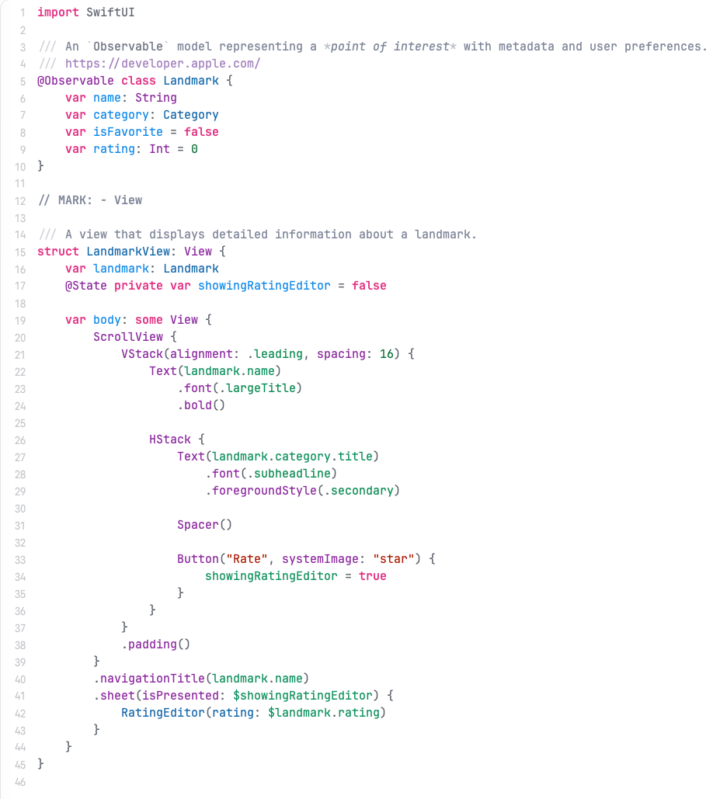

# Fairy Land

A light Xcode syntax theme, made for my own everyday use — light backgrounds are easier on the eyes for long reading sessions than dark ones. Ships with [JetBrains Mono](https://www.jetbrains.com/lp/mono/) as the default font (OpenSource), though it reads just as well on Xcode's stock font if you'd rather keep that.



## Palette

| Role | Color |
|---|---|
| Keyword |  |
| String / character literal |  |
| Number literal |  |
| Your own types |  |
| Your own functions/methods |  |
| Your own properties — declaration site |  |
| Your own properties/variables — usage site |  |
| Your own constants |  |
| System/framework types & functions |  |
| System/framework constants |  |
| System/framework variables |  |
| Preprocessor / macros |  |
| Links (doc comments) |  |
| Comment |  |
| Plain text / local variables |  |
| Background |  |

**Design rule:**

- **Origin decides the hue** — blue for anything defined in your own code (types and functions/methods alike); purple for anything from a system framework or library (types and functions/calls alike).
- **Role decides the shade** within a family — types get a darker, more saturated tone; functions/properties get a lighter one.
- **Green is reserved for values** — assignments, parameters, numeric literals, constants — kept separate from the structural blue/purple axis on purpose.

## Xcode

Two files are shipped, for two different Xcode generations:

**On Xcode 27+**, use `FairyLand.xcworkspacecolortheme` — drop it in and it shows up directly in **Xcode → Settings → Themes**, no import step needed:

```bash
cp xcode/FairyLand.xcworkspacecolortheme "$HOME/Library/Developer/Xcode/UserData/FontAndColorThemes/"
```

`FairyLand.xccolortheme` is Xcode's older classic per-category format (a plist), kept for **Xcode 26 and earlier**. On Xcode 27 it isn't directly selectable — it has to be imported first (via Font & Colors settings), at which point Xcode auto-generates its own `.xcworkspacecolortheme` companion from it anyway. It was also the easiest format to script the fine-grained blue/functions vs. green/values vs. purple/system distinctions against while tuning this palette, which is why the repo carries both.

If **Fairy Land** doesn't show up in the theme list, quit Xcode fully and relaunch — it only scans that folder at launch.

## iTerm2, Ghostty, Warp, VS Code — WIP

Everything below is generated from the same palette as the Xcode theme, but **only the Xcode theme has actually been used and tuned by eye** — these ports haven't been run for real yet, so treat them as a starting point rather than a finished product. Colors that look balanced in an editor don't necessarily map cleanly onto a 16-color terminal palette or VS Code's token scopes; expect to need adjustments.

### iTerm2

Double-click `iterm2/FairyLand.itermcolors`, or import it from **Settings → Profiles → Colors → Color Presets → Import**, then select it as the active preset.

### Ghostty

Copy the theme file into Ghostty's themes directory and reference it from your config:

```bash
mkdir -p "$HOME/.config/ghostty/themes"
cp ghostty/fairy-land "$HOME/.config/ghostty/themes/"
echo 'theme = fairy-land' >> "$HOME/.config/ghostty/config"
```

### Warp

Copy the theme into Warp's themes directory; it will show up in **Settings → Appearance → Themes**.

```bash
mkdir -p "$HOME/.warp/themes"
cp warp/fairy_land.yaml "$HOME/.warp/themes/"
```

### VS Code

Install as an extension from source:

```bash
cd vscode
npm install -g @vscode/vsce   # if you don't have it already
vsce package
code --install-extension fairy-land-theme-1.0.0.vsix
```

Then pick **Fairy Land** from **Preferences → Color Theme**.

## Design notes

Same palette, different mapping per surface — an editor has semantic token roles (keyword, string, type...) that don't exist in a terminal, which only has 16 ANSI slots plus foreground/background/cursor/selection. Rather than forcing a literal 1:1, each port maps the palette to whatever roles that surface actually has, keeping the same colors meaning the same thing everywhere.

## Roadmap

- [ ] Dark variant — same pink/purple/blue identity, adjusted for contrast on a dark background.

## License

[MIT](LICENSE)
